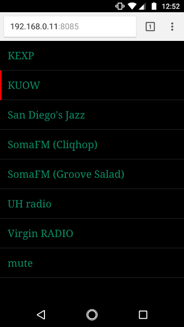

# Simple home streaming radio player with a Web UI (built for Raspberry Pi)

A minimalist ```netcat```-based Web server, written entirly in Bash, allows switching radio channels from any device with access to the home network.



This was built and tested on the June 2018 version of Raspbian.

## Getting started

1. Make sure ```mpg321``` is intalled (```sudo apt-get mpg321```)
2. ```sudo ./install.sh```
3. ```sudo service shradio start```
4. (optional) ```sudo systemctl enable shradio``` to make the service automatically start at boot

Radio channels are currently defined in [radio.sh](radio.sh). ```mpg321``` was used to play the audio stream, but any other command should work just as well.

## Usage

Navigate to ```http://<ip address>:8085```
